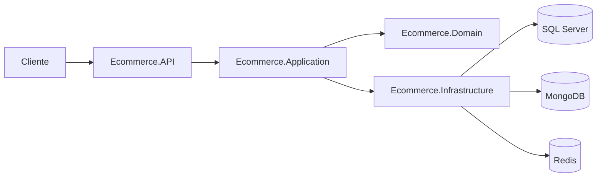

# Ecommerce API

API RESTful em .NET para gerenciamento de pedidos de e-commerce.

## Stack

- .NET 10
- ASP.NET Core
- Entity Framework Core
- SQL Server
- MongoDB
- Redis
- MediatR
- FluentValidation
- AutoMapper
- Serilog
- Swagger
- Docker / Docker Compose

## Arquitetura



## Projetos

- `Ecommerce.API`: controllers, Swagger, tratamento de erros e configuração da aplicação.
- `Ecommerce.Application`: casos de uso, comandos, queries, validações e contratos.
- `Ecommerce.Domain`: entidades, regras de negócio e exceções de domínio.
- `Ecommerce.Infrastructure`: EF Core, SQL Server, MongoDB, Redis e repositórios.
- `Ecommerce.Tests`: testes unitários.

## Como Rodar

```bash
docker compose up --build
```

API:

```text
http://localhost:8080
```

Swagger:

```text
http://localhost:8080/swagger
```

OpenAPI:

```text
http://localhost:8080/openapi/v1.json
```

## Rodar Testes

```bash
dotnet test Ecommerce.sln
```

## Endpoints Principais

### Pedidos

```text
POST   /api/v1/orders
GET    /api/v1/orders
GET    /api/v1/orders/{id}
PATCH  /api/v1/orders/{id}/customer
POST   /api/v1/orders/{id}/items
PUT    /api/v1/orders/{id}/items/{productId}
PATCH  /api/v1/orders/{id}/process
PATCH  /api/v1/orders/{id}/ship
PATCH  /api/v1/orders/{id}/cancel
DELETE /api/v1/orders/{id}
```

### Clientes

```text
POST   /api/v1/customers
GET    /api/v1/customers
GET    /api/v1/customers/{id}
GET    /api/v1/customers/{id}/orders
PUT    /api/v1/customers/{id}
PATCH  /api/v1/customers/{id}
DELETE /api/v1/customers/{id}
```

### Produtos

```text
POST   /api/v1/products
GET    /api/v1/products
GET    /api/v1/products/{id}
PUT    /api/v1/products/{id}
PATCH  /api/v1/products/{id}
DELETE /api/v1/products/{id}
```

### Health

```text
GET /api/v1/health
```

## Observações

- SQL Server é usado como base transacional.
- MongoDB é usado como read store.
- Redis é usado para cache de consultas de pedidos.
- Migrações são aplicadas automaticamente no Docker Compose.
